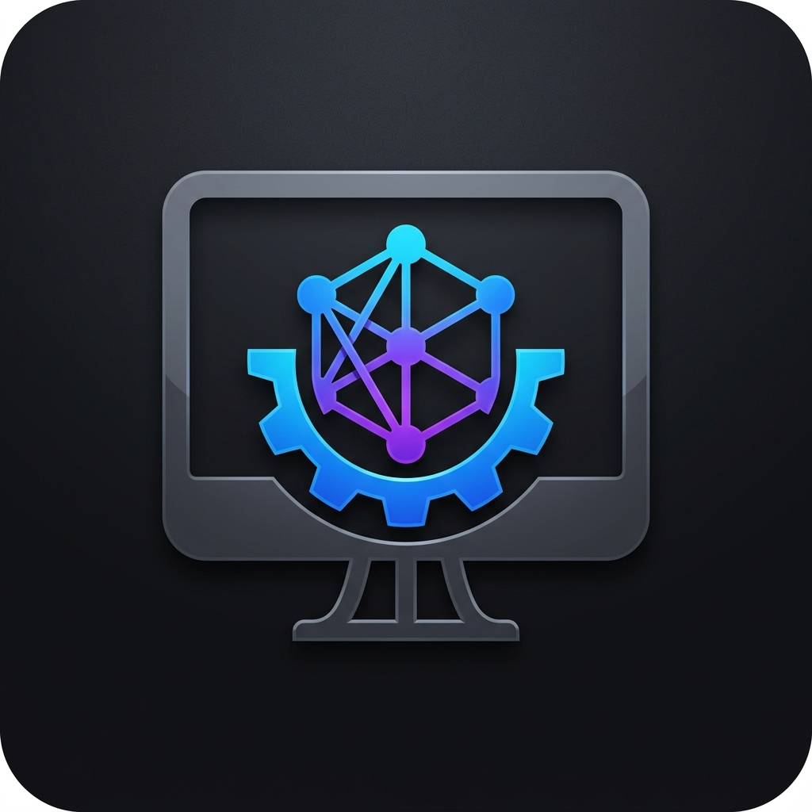
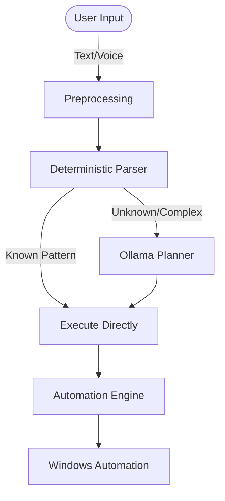

# 🚀 System Automation Assistant

<div align="center">
  
</div>

> An AI-powered Windows desktop automation assistant that understands natural language, maintains conversational context, and performs real operating system tasks using a hybrid deterministic + AI architecture.

<div align="center">
  
  
  
  
  
  
</div>

---

## 📌 Project Overview

**System Automation Assistant (SAA)** is an intelligent desktop automation platform developed during a **30-day Software Development Internship at Softwingz Infotech**.

Unlike traditional AI assistants that depend entirely on Large Language Models for everything, SAA uses a **hybrid architecture**:

- **Deterministic Parsing** for known commands (fast, zero hallucinations).
- **AI Planning** only when required for complex or unknown workflows.
- **Context-Aware Conversation** (understanding "it", "this", "previous application").
- **Direct Windows Automation** using native APIs.

> [!TIP]
> This approach provides fast execution, predictable behavior, and safe command pipelines while still offering natural, conversational AI capabilities.

---

## 📊 Repository Stats

| Metric | Value |
|---|---|
| **Project Duration** | 30 Days |
| **Python Files** | 40+ |
| **Automated Tests** | 536+ |
| **Architecture** | Hybrid AI |
| **Platform** | Windows Desktop |

---

## 📌 Highlights

- Hybrid Deterministic + AI Architecture
- Context-Aware Desktop Automation
- Voice Commands
- Native Windows Automation
- Modern PySide6 Desktop GUI
- 536+ Automated Tests
- Production Ready

---

## 🎯 Example Commands

- *Open Chrome*
- *Create folder Projects*
- *Set brightness to 30%*
- *Mute volume*
- *Take screenshot*
- *Search Google for ChatGPT*
- *Open Notepad and maximize it*
- *Open WhatsApp then focus it*
- *Create notes.txt then open it*
- *Delete folder Test*
- *Turn Wi-Fi off*

---

## ✨ Features

| Feature | Description | Example |
|---|---|---|
| **Natural Language Understanding** | Understands conversational English rather than requiring predefined commands. | *"Open Chrome and search ChatGPT"* |
| **Context Awareness** | Remembers previous actions. Understands references like "it", "this", or "that". | *"Open Notepad, create a file called notes.txt, open it, then delete it"* |
| **Multi-Step Commands** | Chains multiple operations in a single natural sentence. | *"Open Calculator and maximize it"* |
| **Voice Commands** | Local speech-to-text integration using Faster Whisper and Vosk. | Speak your automation tasks directly. |

---

## 🛠 Supported Commands

<details>
<summary><b>📂 Filesystem Automation</b></summary>

- Create Files
- Create Folders
- Rename Files
- Delete Files
- Copy Files
- Move Files
- Search Files
- Open Files
- Folder Navigation
</details>

<details>
<summary><b>🖥 Application Management</b></summary>

- Open Applications
- Close Applications
- Detect Running Applications
</details>

<details>
<summary><b>🪟 Window Management</b></summary>

- Focus Windows
- Minimize
- Maximize
- Restore
- List Open Windows
- Active Window Detection
</details>

<details>
<summary><b>🌐 Browser Automation</b></summary>

- Launch Browser
- Open Websites
- Google Search
</details>

<details>
<summary><b>⚙ System Controls</b></summary>

- Volume Control
- Brightness Control
- Screenshot
- Wi-Fi Management
- Power Management
</details>

---

## ⚙ Project Workflow & Architecture

The project workflow relies on a hybrid execution pipeline that guarantees known commands never require an LLM, reducing latency to milliseconds.



---

## 🧰 Tech Stack

- **Languages:** Python 3.13
- **GUI:** PySide6
- **AI:** Ollama, Llama 3.1
- **Automation:** `pywin32`, `PyAutoGUI`, `psutil`, `ctypes`
- **Voice:** Faster Whisper, SpeechRecognition
- **Testing:** `pytest`

---

## 📁 Folder Structure

```text
SystemAutomationAssistant/
├── docs/               # Technical documentation
├── logs/               # Application runtime logs
├── scripts/            # Setup and utility scripts
├── src/                # Main source code
│   ├── automation/     # Execution engine
│   ├── context/        # State and memory management
│   ├── core/           # Core parsers and registries
│   ├── gui/            # PySide6 components
│   ├── llm/            # Ollama integrations
│   ├── nlp/            # NLP pipelines
│   ├── parser/         # Deterministic parsers
│   ├── planner/        # AI task planners
│   ├── tools/          # Action handlers
│   ├── utils/          # Helper utilities
│   └── voice/          # STT integration
├── tests/              # 536+ pytest suite
├── gui_main.py         # Entry point (GUI)
└── main.py             # Entry point (CLI)
```

---

## 💻 Requirements

- Windows 10/11
- Python 3.13+
- Ollama
- 8 GB RAM Recommended

---

## ⚙ Installation & Setup

1. **Clone the repository**
   ```bash
   git clone https://github.com/Kavi7605/SystemAutomationAssistant.git
   cd SystemAutomationAssistant
   ```

2. **Create and activate a virtual environment**
   ```bash
   python -m venv venv
   venv\Scripts\activate
   ```

3. **Install dependencies**
   ```bash
   pip install -r requirements.txt
   ```

4. **Install Ollama**
   Download and install Ollama from [ollama.com](https://ollama.com).
   Pull the required model:
   ```bash
   ollama pull llama3.1
   ```

---

## ▶ Usage

> [!NOTE]
> Ensure Ollama is running in the background before launching.

**Launch GUI version:**
```bash
python gui_main.py
```

**Launch CLI version:**
```bash
python main.py
```

---

## ✅ Testing

The project contains an extensive automated testing suite to prevent regressions.

- **536+ Automated Tests Passing**
- Covers Unit Tests, Integration Tests, Parser Tests, and Filesystem Tests.

```bash
pytest tests/
```

---

## 🚀 Future Scope

- Plugin architecture for external apps
- Cross-platform support (Linux & macOS)
- Cloud synchronization
- Standalone Installer (.exe)
- Wake-word voice activation
- Personalization & user preferences

---

## 📄 License

This project is open-source and available under the standard MIT License.

---

## 🎓 Internship Details

This project was developed as part of a **Software Development Internship** at **Softwingz Infotech**.
* **Duration:** 09 June 2026 – 08 July 2026
* **Institute:** Chandubhai S. Patel Institute of Technology (CSPIT)
* **University:** CHARUSAT University

---

## 👨‍💻 Author

**Kavya Chavda**
B.Tech Information Technology
Chandubhai S. Patel Institute of Technology (CSPIT), CHARUSAT University

[](https://github.com/Kavi7605)

⭐ *If you found this project interesting, consider giving it a star!*